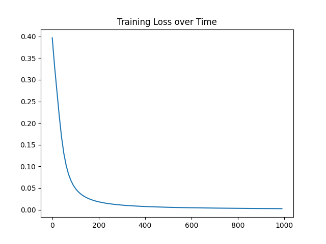

# BasicNeuralNetwork
This project looks over the basic structure of a neural network and how machine learning training algorithms work. For this project, I used the sigmoid function as an activation function along with stochastic gradient descent to adjust the weights and biases.

For this project, this neural network predicts the gender of an individual (either male or female) based on their height and weight.

## Training Time and Loss

Time to train neural network: Around 1 to 2 sec

Graph shows Mean-Squared-Error (MSE) loss over time. As the loss decreases over time, the network has a better understanding of how to classify the gender of an individual.

# References

[3Blue1Brown's videos on Neural Networks](https://www.youtube.com/watch?v=aircAruvnKk&list=PLZHQObOWTQDNU6R1_67000Dx_ZCJB-3pi) 

[Victor Zhou's Introduction to Neural Networks](https://victorzhou.com/blog/intro-to-neural-networks/)
